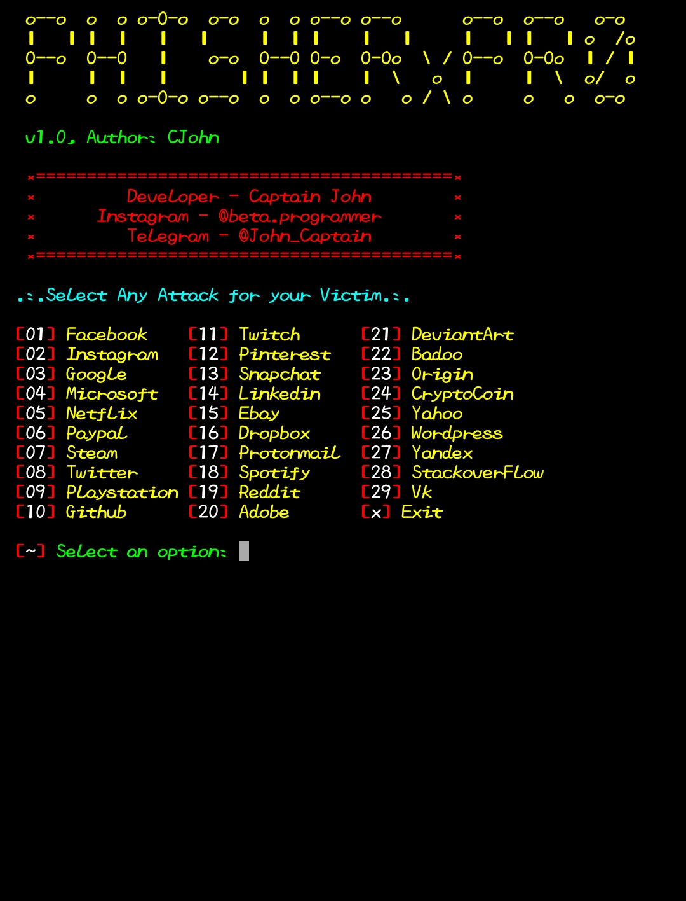

## Installation :

* `apt update`
* `apt install git curl php openssh -y`
* `https://github.com/jineshnagori/PHISHERxPRO.git`
* `cd PHISHERxPRO`
#### > Run : `bash PHISHERxPRO.sh`

 

### <<< If you copy , Then Give me The Credits >>>

## Features :
#### [+] Latest Login Pages !
#### [+] New Instagram Auto Follower Page !
#### [+] 4 Port Forwarding Options !
#### [+] Easy for Beginners !

## Credits :
#### > Captain John

## Tunelling Options :
#### > Localhost (127.0.0.1)
#### > NGROK (https://ngrok.com)
#### > SERVEO (https://serveo.net)
#### > LOCALHOSTRUN (https://localhost.run)

## Find Me on :

